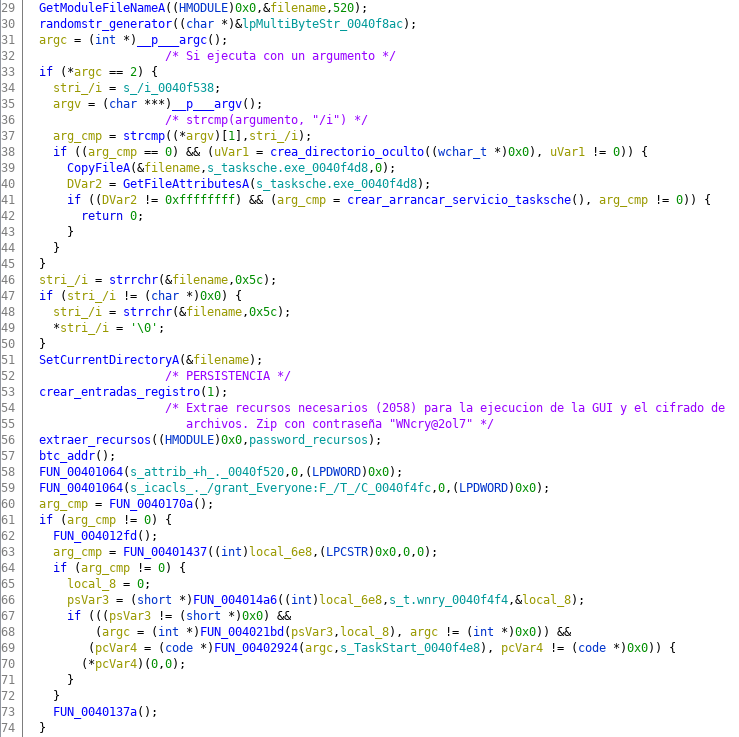

# Introducción

Un ransomware es un tipo de malware que secuestra la información de la víctima y amenaza con publicarla o bloquear su acceso de forma permanente mediante su cifrado a menos que su rescate sea pagado. Dicho pago se hace normalmente a través de criptodivisas como Bitcoin, lo que dificulta el rastreo de los delincuentes.

El ataque sucedido el 12 de mayo de 2017 que tuvo como protagonista al ransomware WannaCry ha sido descrito como sin precendentes y afectó a más de 230.000 computadoras de más de 150 países, incluyendo compañías importantes como Telefónica en España, FedEx e incluso departamentos del servicio nacional de salud de Gran Bretaña.

Es común encontrar descripciones que definen este malware como un criptogusano, esto es debido al comportamiento que refleja y lo que, probablemente, propició el gran alcance del ataque a nivel mundial. Esta característica es algo poco común respecto a otros ransomware, ya que lo normal es que los ataques de este tipo se lleven a cabo mediante troyanos que llegan a los equipos de las víctimas a través de campañas de phishing. Sin embargo WannaCry se expandía de forma automáticamente por los equipos de la red tras la infección de un equipo.

Dicha expansión se llevaba a cabo mediante el uso del exploit *EternalBlue*, que fue revelado por el grupo *The Shadow Brokers* el 14 de abril (1 mes antes del ataque). Dicho exploit se aprovecha de la vulnerabilidad *MS17-010* del protocolo *Server Message Block*. El detalle importante es que Microsoft liberó un parche para esta vulnerabilidad el 14 de marzo (2 meses antes del ataque), sin embargo, es probable que debido al poco margen de tiempo y la falta de concienciación dicha actualización no fuera aplicada en la mayoría de equipos. Una actualización que además no cubría versiones de Windows XP.

Aunque es un ataque de gran gravedad, las consecuencias podrían haber sido peores si no se hubiera descubierto el *kill-switch* que detuvo la propagación o si hubiera sido un ataque dirigido a infraestructuras críticas, como centrales nucleares o eléctricas.

En este documento se tratará el contexto que acompañaba al suceso, se documentará el funcionamiento del malware, se hablará del impacto que tuvo y la perspectiva actual que se tiene sobre los ataques ransomware. Además se comentarán las diferentes teorías sobre la, poco clara, autoría del ataque y se realizará un análisis técnico de una muestra del malware mediante técnicas de ingeniería inversa.

# Antecedentes

# Funcionamiento

# Impacto

# Atribución del ataque

# Análisis técnico de una muestra

Para el desarrollo de esta parte, se ha realizado un **análisis estático** de una muestra del malware que se encuentra en el repositorio the Github [*TheZoo*](https://github.com/ytisf/theZoo). Las principales herramientas usadas son:

* [**Ghidra**](https://github.com/NationalSecurityAgency/ghidra): Framework de ingeniería inversa desarrollado por la NSA.
* **wrestool**: Herramienta para la extracción de recursos en ejecutables Windows perteneciente al paquete *icoutils*.

El análisis se ha llevado a cabo en un una máquina virtual aislada con sistema operativo *Kali Linux 2019.3*. Aunque es un malware que no funciona en Linux, se considera una buena práctica realizar análisis de malware en equipos aislados y que no tengan un uso compartido. Esto es para evitar infectar un sistema que pueda tener información que nos resulte importante y evitar así contagios en otros equipos de la red local.

El procedimiento que se ha llevado a cabo en el análisis consiste resumidamente en identificar los puntos de entrada del ejecutable, a partir del `main`, inferir el funcionamiento de las funciones usadas por orden y una a una de forma recursiva. Tras llevar a cabo el renombrado de las variables existentes en la función y haber comentado los bloques con el fin de aclarar el flujo de ejecución, se ha dado un nombre característico a cada función que permita conocer la tarea que realiza de forma clara.

Se ha determinado como objetivos de este análisis dos sencillos puntos que permitan ilustrar de forma esquemática y empírica el funcionamiento del malware:

* Encontrar el famoso *kill-switch*, relevante sobretodo para la expansión del malware.
* Realizar el desempaquetado del ejecutable con el fin de extraer los recursos que contiene para poder diferenciar los módulos que componen el malware y como interactúan ente si.

Dicho esto, comenzamos el análisis cargando el *primer* ejecutable en Ghidra. Se trata de un PE32, es decir, un ejecutable para sistemas de 32 bits. Conociendo el funcionamiento de *Portable Executable* debemos identificar la llamada a la función `main` situada al final de la función `entry`. Una vez nos hemos desplazado al `main`, comenzamos el renombrado de variables y funciones para clarificar el funcionamiento de esta primera parte.

Sin habernos demorado más de 10 minutos, hemos encontrado el *kill-switch* encontrado por Marcus Hutchins, con el que paró el ataque en su día y que, según él, [fue de forma accidental](https://www.malwaretech.com/2017/05/how-to-accidentally-stop-a-global-cyber-attacks.html).

Como vemos en la figura, tenemos una variable con la URL al dominio www[.]iuqerfsodp9ifjapos dfjhgosurijfaewrwergwea[.]com que es copiada a un buffer e inmediatamente después se inicia una conexión y se hace una petición a dicha URL. Después, se comprueba si ha encontrado el dominio o no. Si no lo encuentra, es decir, la conexión falla, el malware continúa la ejecución a través de la función que ha sido llamada `CRYPTOR_REAL_ENTRY()`. Si consigue la conexión, el programa termina su ejecución.

Continuamos el análisis en la función definida como el punto de entrada real del malware. Una vez se ha depurado la función, se puede ver que se comprueba el número de argumentos y que si éste es uno, se continua por una función renombrada como `cocinar_wannacry()`.

Es una función bastante simple que contiene únicamente la llamada a otras dos funciones, cuyo análisis completo no se va a incluir en este documento. En definitiva, la primera función, crea un servicio de nombre "mssecvc2.0" que será usado en etapas posteriores por la componente gusano del malware. La segunda función, extrae un recurso (1831) del ejecutable, nombrado *tasksche.exe*, y lo ejecuta.

Para extraer dicho recurso nosotros mismos, se hace uso de la herramienta *wrestool* como se ilustra en la figura. Como se puede comprobar, se trata de otro ejecutable que vamos a cargar en Ghidra para continuar el análisis.

Cargado el ejecutable, repetimos el procedimiento renombrando variables y funciones de la función `main` obteniendo como resultado lo que aparace en la figura.

De forma resumida, este ejecutable, primero, va a crear una carpeta oculta generando el nombre a partir del hostname y va crear/arrancar el servicio que se ha comentado en la etapa anterior para asegurar la persistencia. Después, va a crear entradas en el registro que apunten a los ejecutables maliciosos para asegurar la persistencia también y va a extraer una segunda ronda de recursos. Estos recursos están comprimidos en un zip con la contraseña "WNcry@2ol7" y contiene imágenes, textos, traducciones y claves para el cifrado de archivos, además de otros ejecutables. Estos binarios serán ejecutados desde hebras distintas y tienen que ver con la GUI que se presenta a la víctima, utilidades de limpieza de archivos y la expansión del malware mediante EternalBlue.

En resumen, se van a extraer dichos recursos para completar el despezado del malware y poder señalar cada módulo o parte y cómo interactúan entre sí.

Los archivos son los siguientes:

* *b.wnry*: Imagen que el malware coloca como fondo de pantalla en la que da indicaciones a la víctima.
* *c.wnry*: Contiene información sobre dominios TOR con los que se comunica el malware.
* *msg/*: Contiene las traducciones del texto que se presenta a la víctima con las instrucciones para recuperar la información.
* *r.wnry*: Más texto informativo para la víctima.
* *s.wnry*: Zip que contiene archivos relacionados con TOR y la comunicación con el C&C.
* *taskdl.exe*: Utilidad de limpieza que el malware utiliza.
* *taskse.exe*: Ejecutable maliciosos usado en la etapa de expansión que explora la red en busca de equipos vulnerables.
* *t.wnry*: Una DLL cifrada que es la que, en realidad, desempeña el cifrado de los archivos del sistema.
* *u.wnry*: Ejecutable que muestra la GUI a la víctima con la cuenta atrás y las instrucciones para el pago del rescate

Por tanto, el malware ejecutaría dos etapas previas al cifrado de archivos en las que realiza acciones que aseguran la persistencia del malware en el sistema y despliega los recursos empaquetados en lugares específicos que después son ejecutados para cifrar los archivos (*t.wnry*), informar a la víctima del secuestro (*u.wnry*) y expandirse a otros equipos mediante el exploit EternalBlue (*taskse.exe*). Este último ejecutable se comunicaría con el servicio creado en una etapa anterior, llamado *mssecvc2.0*, que intentaría enumerar sesiones RDP activas en busca de nuevos equipos.

# Conclusión

# Bibliografia

* [WannaCry Ransomware Attack. Wikipedia](https://en.wikipedia.org/wiki/WannaCry_ransomware_attack)
* [WannaCry Malware Profile. Fireeye](https://www.fireeye.com/blog/threat-research/2017/05/wannacry-malware-profile.html)
* [WannaCry Ransomware: Analysis of Infection, Persistence, Recovery Prevention and Propagation Mechanisms.](https://www.il-pib.pl/czasopisma/JTIT/2019/1/113.pdf)
